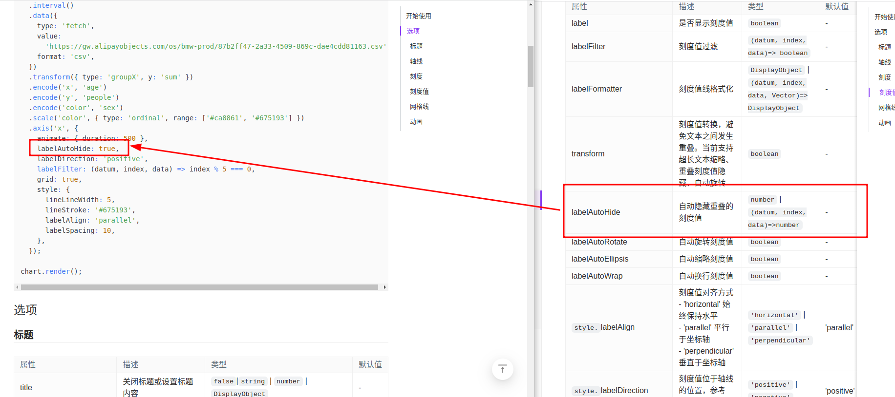
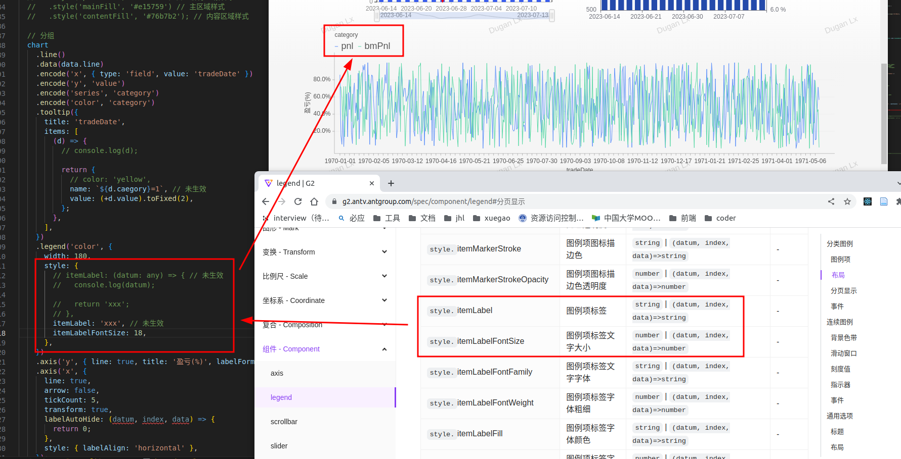
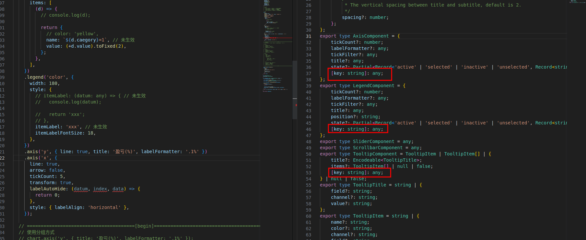
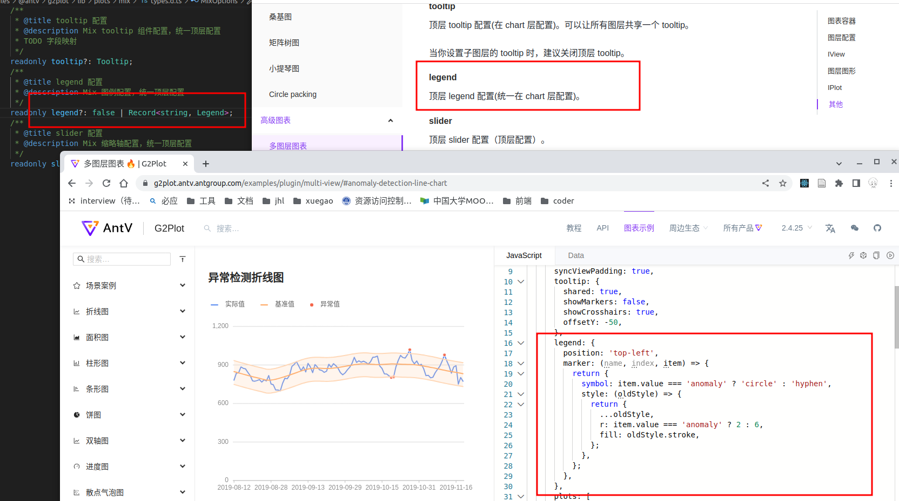
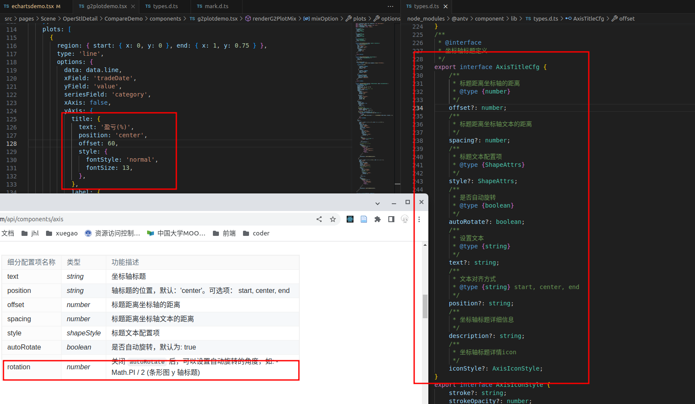
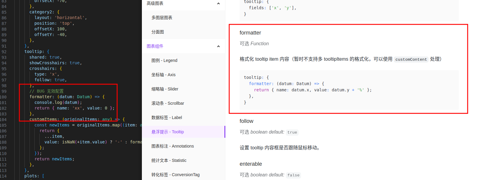
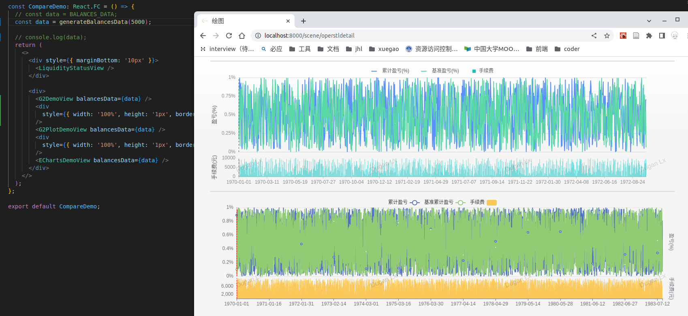
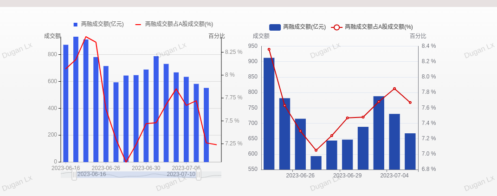

G2、G2Plot可行性报告

3.1 总结

1. G2 和G2Plot目前不够成熟，不建议生产使用。文档说明不够全面，且存在与源代码不一致问题。所给样例也相对比较简单，对于目前QuantWeb中存在的经典使用场景不能够很好的胜任。

2. 在大数据量的情况下，G2的体验没有比ECharts更好

3.2 G2

问题1：说明文档和所给demo有出入

这样的问题，在查阅文档的时候有多处出现。比如，在设计折线图时，设置X轴刻度值不要重叠。

问题2：文档说明的方式，代码实现发现不生效
比如，在画折线图时，需要对legend的显示进行修改为中文。按照文档的说明，使用itemLabel进行设置，但是未生效。同一级别的itemLabelFontSize设置则可以正常生效。（对于Tooltip也存在该问题）

问题3：代码实现上使用了大量的[key: string]: any;
在它的实现中，大量使用[key: string]: any；导致在文档写的不清楚的状况下，想通过看源码去推测使用成为不可能。

3.3 G2Plot

问题1：文档描述和代码实现说法不一致

使用G2Plot的Mix组件，设置图例的参数 legend，在官方文档以及文档中的用例都是 Legend类型，但是在源代码中，则是 Record<string, Legend>。

问题2：设计不合理
如果想要把y轴的标题放在与刻度值相反的地方，只能靠offset设置像素（在页面缩小时会出问题），且同样出现了文档和源代码不一致的问题（文档中说有rotation字段，而源代码中并没有）。

问题3：配置无效

在使用Mix组件配置tooltip时，formatter配置无效，但是文档并没有说明是否正常

问题4：实际测试，性能优化与Echarts差不多。当数据量达到5000条时，G2Plot的tooltip的展示比Echarts的展示流畅度更差

问题5：简单图形实现效果不如ECharts体验好

对于市场观察的“流动性、两融情况”的图而言，使用ECharts实现的效果可以利用鼠标滚轮放大/缩小图形，并且按住鼠标左键可以拖拽图片进行移动，而G2Plot目前仅能使用底部的缩略轴进行实现。

